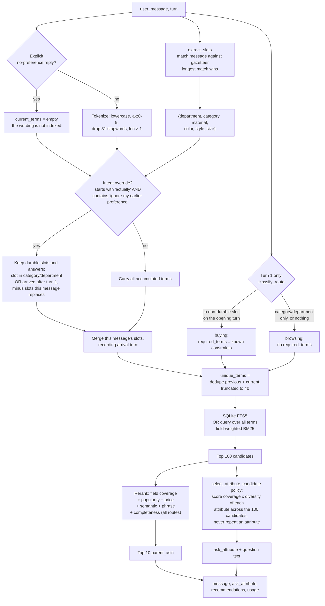
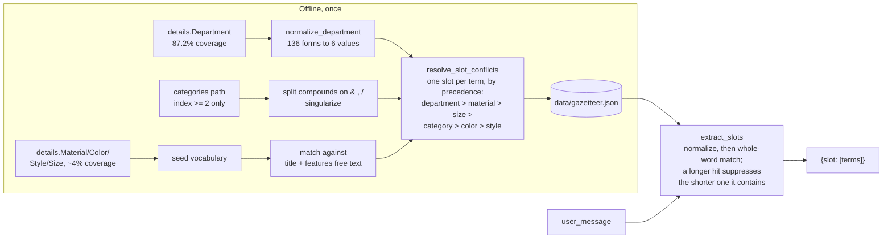
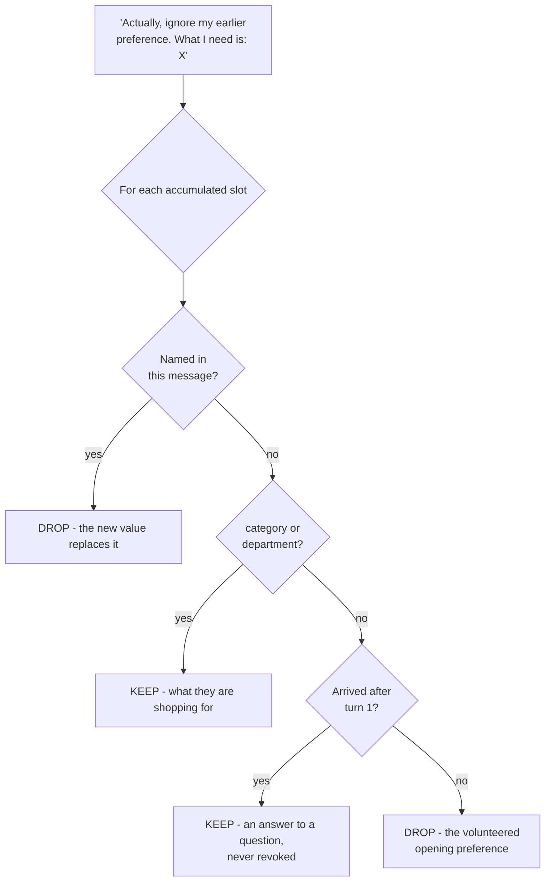
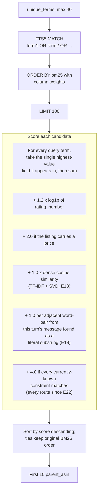

# Architecture: what happens on one turn

Current best is **E22**, public TechnicalScore `0.884741`. This describes the
code as it runs today, not the design plan.

Everything here is stdlib plus scikit-learn and numpy
([`requirements.txt`](../requirements.txt)); there is still no neural model,
no pretrained weights, no network access, and zero reported tokens. The
dependency arrived with E18: `starter/agent.py` imports
[`starter/dense.py`](../starter/dense.py) unconditionally, so scikit-learn is
required merely to construct an `Agent`, not only for the optional
`retrieval_mode="dense"/"rrf"` paths. The dense index is TF-IDF + Truncated
SVD (latent semantic analysis) over the frozen catalog, built once at
startup.

Entry point is `Agent.respond(session_id, user_message, turn, top_k)` in
[`starter/agent.py`](../starter/agent.py).

## The whole turn

`select_attribute` supports five policies -- `fixed`, `profile`, `candidate`
(the default), `entropy`, and the `other` diagnostic probe. Only `candidate`
is shipped; the rest exist as ablation arms. See
[clarification-ablation.md](../reports/experiments/clarification-ablation.md).

## Slot extraction

The gazetteer is mined offline from the frozen catalog by
[`scripts/build_gazetteer.py`](../scripts/build_gazetteer.py) and shipped as
`data/gazetteer.json` (19 KB, 842 terms). It is built once, not per turn.

Index 0 of a category path is the catalog root and index 1 is the
department/merchandising level. Amazon promo nodes such as `Westlake`,
`Clearance` and `Prime Day: 30% off` only ever appear as a sole child of the
root, so requiring index >= 2 excludes them structurally.

Bootstrapping recovers far more coverage than the structured fields alone:

| Slot | `details` only | After free-text match |
| --- | ---: | ---: |
| material | 4.1% | 81.6% |
| color | 4.9% | 69.5% |
| style | 3.5% | 61.1% |
| size | 1.8% | 51.0% |

## Intent override: what survives

An override replaces a preference, not the thing being shopped for. Clearing
everything would forget that the customer wants a *belt*.

## Retrieval and ranking

BM25 column weights and rerank field weights are separate tables:

| Field | BM25 weight | Rerank weight |
| --- | ---: | ---: |
| title | 6.0 | 4.0 |
| categories | 4.0 | 3.0 |
| features | 2.5 | 2.0 |
| details | 2.5 | 2.0 |
| store | 1.5 | 1.5 |
| description | 1.0 | 1.0 |
| parent_asin | 0.0 | not scored |

### Why popularity is weighted

The hidden target is a **real purchase record**, and purchased items are
reviewed items.

| | Catalog | Targets |
| --- | ---: | ---: |
| Median `rating_number` | 12 | **6,846** |

The median target sits at the 99.5th percentile of catalog popularity; 193 of
200 fall in the top quartile. `rating_number` has 100% coverage and was unused
until E11.

This is a prior about **how the dataset was built**, not personalization. It is
not a bestseller list: an agent that ignores the conversation entirely and
returns the globally most-reviewed items every turn scores HitRate@10 `0.035`.
Retrieval narrows 50,000 products to a hundred; popularity orders that hundred.

Weight `1.2` was chosen on the held-out validation split. Development and
validation peak there independently and 0.8-1.8 is a plateau. Above 8 the prior
starts overwhelming constraint matching and Boundary drops from `0.9000` to
`0.8000`. See [popularity-prior.md](../reports/experiments/popularity-prior.md).

### Why price presence is weighted

The same reasoning one field over. A target is a real purchase, and only an
active listing can be purchased.

| | Catalog | Targets |
| --- | ---: | ---: |
| Carries a price | 21.1% | **89.0%** |

The gap is not popularity in disguise: inside the catalog's top popularity
decile, where 173 of 200 targets already sit, only `31.6%` of products are
priced against `89.0%` of the targets. Only presence is scored, never the price
value, and it is a bonus rather than a filter because 11% of targets carry no
price at all.

This prior is the one layer whose gain **reverses** under the project's
coverage-stress diagnostic: `+0.012194` on the official catalog against
`-0.020274` when target price coverage is cut to the catalog-wide rate. It
is retained because official metrics select methods, but its margin depends
on a property of how the public set was built. See
[experiment_history.md](experiment_history.md) T26.

`average_rating` was measured and swept the same way and ships at `0.0`: once
popularity is controlled for, the target/catalog gap collapses from `0.285` to
`0.084`, and the two splits disagree about the weight. The code path exists but
is off. See
[price-rating-prior.md](../reports/experiments/price-rating-prior.md).

## Constants

| Constant | Value | Where |
| --- | ---: | --- |
| `CANDIDATE_POOL_SIZE` | 100 | `starter/agent.py` |
| `POPULARITY_WEIGHT` | 1.2 | `starter/agent.py` |
| `SEMANTIC_WEIGHT` | 1.0 | `starter/agent.py` |
| `PHRASE_WEIGHT` | 1.0 | `starter/agent.py` |
| `COMPLETENESS_BONUS` | 4.0 | `starter/agent.py` |
| `COMPLETENESS_ALL_ROUTES` | True | `starter/agent.py` |
| `RECENCY_WEIGHT` | 0.0 (disabled) | `starter/agent.py` |
| `PRICE_WEIGHT` | 2.0 | `starter/agent.py` |
| `RATING_WEIGHT` | 0.0 (disabled) | `starter/agent.py` |
| `DURABLE_SLOTS` | category, department | `starter/agent.py` |
| `OPENING_TURN` | 1 | `starter/agent.py` |
| term cap | 40 | `starter/agent.py` |
| default clarification policy | `candidate` | `starter/clarification.py` |
| gazetteer terms | 842 across 6 slots | `data/gazetteer.json` |

## What is deliberately absent

- No neural network, no pretrained weights, no LLM. Zero tokens reported.
  The only "embedding" is E18's TF-IDF + SVD index, fit on the frozen catalog
  at startup: term co-occurrence structure, not learned semantics.
- No network access on the scored path.
- Candidate pool 500 was tested and rejected: `-0.001461` (E7).
- IDF weighting was tested and rejected at both pool sizes and behind an
  override-only route: `-0.0143` at best (E8, E10).
- Dense retrieval replacing BM25 was tested and rejected: `-0.247707` (E16).
  Fusing the two by Reciprocal Rank Fusion was also rejected: `-0.017014`,
  traced to pool truncation evicting good candidates (E17). The dense index
  survives only as a reranking signal (E18).
- Query-side stemming was tested and rejected: `-0.047052`, traced to a
  broader query overflowing the fixed 100-candidate cutoff (E20).
- Making the completeness bonus prior-proof by raising it was tested and
  rejected: `+0.000000` at both 8.0 and 16.0 on the Buying route, byte-for-byte
  identical output. The gain attributed to that idea came entirely from
  applying the bonus to Browsing sessions instead (E22).
- Turn-recency term weighting was tested and rejected: a clean monotonic
  decline with no peak, `-0.000762` at weight 0.1 falling to `-0.031340` at
  1.0 (E23). The opening category term is what holds the candidate pool
  on-topic; down-weighting it widens the pool rather than sharpening it.
- Choosing the clarification attribute by Shannon entropy of its value split
  instead of `coverage x diversity` was tested and rejected twice
  independently: `-0.000437` full (E14) and `-0.001812` validation on a
  separate implementation. Retained as the `entropy` policy for ablation;
  the default remains `candidate`.
- If `data/gazetteer.json` is missing the agent degrades silently to pre-slot
  behaviour rather than raising, costing roughly `0.84 -> 0.73`. Check that file
  first if a run reports a lower score.
